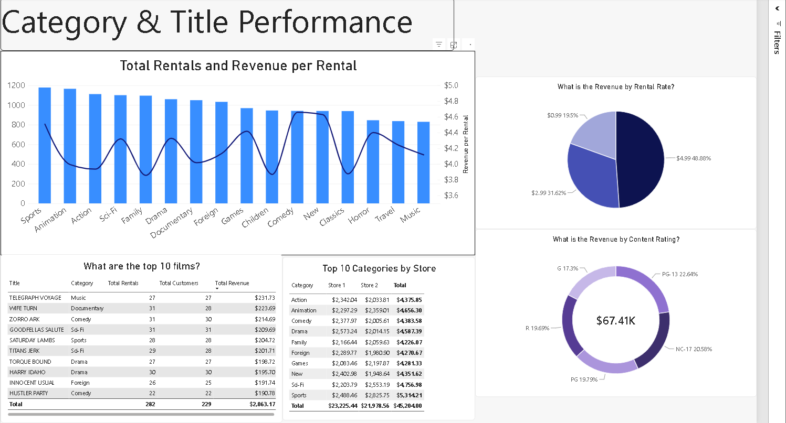

# SQL & Power BI Business Analysis — Video Rental Revenue and Inventory Optimization
 
## Overview
This project analyzes a video rental company's data in two stages: a SQL analysis
answering eight business questions, and a Power BI dashboard built on a dimensional
model that turns those one-off answers into something a stakeholder can explore.
 
The central business question: **which film categories and store locations should
the company prioritize for inventory investment and marketing, and where is money
being lost on underused inventory or at-risk customers?**
 
## Files in this repo
 
| File | What it is |
|---|---|
| [`Averys_portfolio_project.sql`](Averys_portfolio_project.sql) | The 8-question SQL analysis, with findings and takeaways |
| [`table_exports.sql`](table_exports.sql) | The queries that produce the 4 Power BI source tables |
| [`Averys_Rental_Analytics_Dashboard.pbix`](Averys_Rental_Analytics_Dashboard.pbix) | The full interactive Power BI report |
 
## About the Data
This project uses the Sakila sample database (a fictional DVD rental company) to
demonstrate SQL and business analysis skills. The business problem, questions, and
dataset are for portfolio purposes — not live company data — but the analytical
approach (identifying revenue drivers, segmenting customers, spotting
underperforming assets, and translating findings into a recommendation) mirrors
real reporting and analysis work.
 
---
 
# Part 1 — SQL Analysis
 
Eight business questions answered using joins, aggregate functions, CASE WHEN
logic, subqueries, and HAVING clauses — each paired with a finding and a "so what"
takeaway connecting the data back to a business decision.
 
## Key Findings
- **Invest in Comedy, New Releases, and Games** — these categories earn
  above-average revenue per rental ($4.20+), outperforming high-volume
  categories like Action on a per-transaction basis.
- **A large share of the highest lifetime-spending customers are at risk
  of churning** — including top spenders like Karl Seal ($221.55) and
  Eleanor Hunt ($216.54), who haven't rented since mid-to-late 2005.
- **Store 1 and Store 2 perform almost identically**, so there's no
  location-based case for shifting investment between them.
- **No dead inventory** — every title in the catalog has been rented at
  least once, though individual copy-level underuse may still exist.
- **Shorter rental windows show higher late-return rates** — 3-day
  rentals come back late roughly 66% of the time, versus 23% for 7-day
  rentals, suggesting rental duration policy is worth revisiting.
 
## File
See [`Averys_portfolio_project.sql`](Averys_portfolio_project.sql) for all 8 questions, queries, and findings.
 
---
 
# Part 2 — Power BI Dashboard
 
A two-page interactive report built on a star schema.
 
**Overview page:**

 
**Category & Title Performance page:**

 
See [`Averys_Rental_Analytics_Dashboard.pbix`](Averys_Rental_Analytics_Dashboard.pbix) for the full interactive file.
 
## Why the data model was rebuilt
 
The first version of this dashboard ran on flat, pre-aggregated CSV exports — one
file per question. That works until someone asks a question you didn't anticipate,
at which point you go back to SQL and export again.
 
This version exports four raw tables instead and does the joining inside Power BI,
so any combination of dimensions is available without touching the database again.
 
## The star schema
 
```
                    dim_date
                        |
    dim_customer --- fact_rentals --- dim_film
                        |
                    dim_store
```
 
**`fact_rentals`** (16,044 rows) — one row per rental, carrying the foreign keys
(`customer_id`, `film_id`, `store_id`, `rental_date`) and the one additive measure,
`amount`.
 
**`dim_film`** (1,000 rows) — title, category, rating, rental rate, length,
replacement cost. Category was denormalized into this table rather than left as a
separate dimension, keeping the model a star rather than a snowflake.
 
**`dim_customer`** (599 rows), **`dim_store`** (2 rows), and **`dim_date`** — a
calculated table generated with `CALENDAR()` covering 2005–2006 and marked as the
report's date table.
 
All four relationships are one-to-many from dimension to fact, single-direction
cross-filtering. The SQL that produced each source table is in
[`table_exports.sql`](table_exports.sql).
 
## Measures
 
All measures are explicit DAX rather than implicit aggregations, so the same
definition is reused across every visual:
 
```dax
Total Revenue            = SUM(fact_rentals[amount])
Total Rentals            = COUNTROWS(fact_rentals)
Total Customers          = DISTINCTCOUNT(fact_rentals[customer_id])
Revenue per Rental       = DIVIDE([Total Revenue], [Total Rentals])
Avg Revenue per Customer = DIVIDE([Total Revenue], [Total Customers])
 
Revenue % of Total =
DIVIDE(
    [Total Revenue],
    CALCULATE([Total Revenue], ALL(dim_film))
)
```
 
`Revenue % of Total` uses `ALL()` to hold the denominator at the full catalog while
the numerator responds to filter context — so each category shows its share of the
whole business rather than 100% of itself.
 
`Total Customers` is non-additive: category-level rows sum to more than the report
total, because a customer who rents across several categories is counted once in
each and once overall.
 
## Pages
 
**Performance Overview** — headline KPIs, revenue by category, store comparison,
monthly revenue trend, and revenue mix by price point over time.
 
**Category & Title Performance** — rental volume against revenue per rental by
category, revenue share by price point and by content rating, a category × store
matrix, and the top 10 films by rental volume.
 
## What the dashboard shows
 
**$67,407 across 16,044 rentals from 599 customers**, May 2005 – February 2006.
 
**Volume is flat; price is not.** All 16 categories rent at roughly the same rate —
Sports leads at 1,179 rentals, Music trails at about 830. Revenue per rental,
however, ranges from about $3.99 to $4.66. Revenue differences come from what films
cost, not from which categories customers choose.
 
**Half the business sits in one price tier.** Films priced at $4.99 generate 48.9%
of all revenue; $2.99 titles contribute 31.6% and $0.99 titles 19.5%. That
concentration is worth monitoring — revenue is more exposed to pricing and stock
decisions on the premium tier than the even rental volume would suggest.
 
**The two stores are matched on totals but not on mix.** Store 1 took $33,680 and
Store 2 took $33,727 — a gap of $47 on $67K. The category matrix shows they arrive
there differently: Comedy runs $2,378 at Store 1 against $2,006 at Store 2, while
Sports reverses to $2,488 and $2,826. A total-revenue comparison alone would have
reported the two locations as interchangeable.
 
---
 
# Recommendations
 
Pulling the SQL and dashboard findings together, five things the business should
act on:
 
**1. Protect the premium price tier.** Films at $4.99 generate 48.9% of revenue
from a minority of the catalog. Before any repricing or stock reduction, model the
revenue impact on that tier specifically — a change that looks small across the
whole catalog could move half the business.
 
**2. Stop treating the two stores as interchangeable.** Their revenue totals differ
by $47, but their category mixes don't: Comedy runs 19% higher at Store 1 while
Sports runs 14% higher at Store 2. Restocking decisions made off the company-wide
numbers will be wrong for both locations. Order to each store's actual mix.
 
**3. Run a win-back campaign on lapsed high spenders.** Several of the highest
lifetime-value customers — Karl Seal at $221.55, Eleanor Hunt at $216.54 — have
gone inactive. Recovering a customer who has already demonstrated $200+ of spend is
cheaper than acquiring a replacement, and the list is small enough to target
individually.
 
**4. Revisit the 3-day rental window.** Three-day rentals come back late about 66%
of the time, versus 23% for 7-day rentals. Either the window is unrealistically
short for how customers actually watch, or late fees are functioning as unplanned
revenue. Both are worth knowing deliberately rather than by accident.
 
**5. Promote on margin, not on volume.** Rental counts are nearly identical across
all 16 categories, so promoting a "popular" category won't move revenue much.
Revenue per rental varies meaningfully, so promotional space is better spent on
categories that earn more per transaction — Comedy, New Releases, and Games.
 
## Limitations
 
The dataset covers roughly nine months, with most activity concentrated in
May–August 2005 and a short tail in February 2006 — not enough history to separate
seasonality from trend. The model also carries no cost data, so every figure here
is revenue, not profit. And with all 1,000 titles rented at least once, dead
inventory can only be assessed at the title level, not per physical copy.
 
## Tools Used
MySQL Workbench · SQL (joins, aggregates, CASE WHEN, subqueries, HAVING) ·
Power BI Desktop · DAX · Power Query
 
## Reproducing the dashboard
 
1. Run the four queries in [`table_exports.sql`](table_exports.sql) against the Sakila database and
   export each result grid to CSV. Raise the row limit in MySQL Workbench first —
   the default 1,000-row cap silently truncates `fact_rentals` to 6% of its actual
   size.
2. Load the four CSVs into Power BI.
3. Build the relationships as described above, or open the included `.pbix`.
 
   export each result grid to CSV. Raise the row limit in MySQL Workbench first —
   the default 1,000-row cap silently truncates `fact_rentals` to 6% of its actual
   size.
2. Load the four CSVs into Power BI.
3. Build the relationships as described above, or open the included `.pbix`.
